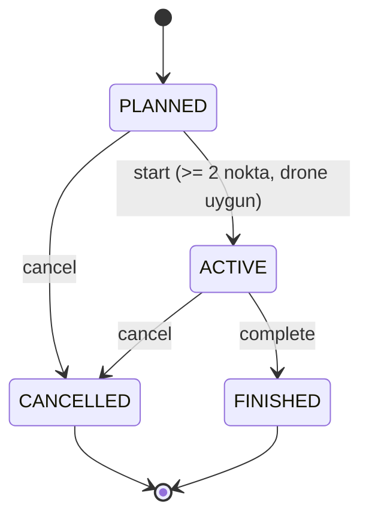
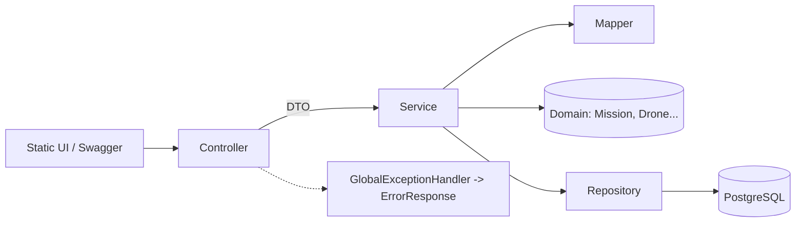

# SkyOps – Drone Görev Planlama Platformu

Operatörlerin drone filosuyla görev planladığı **Spring Boot 3 + PostgreSQL** REST API'si ve hazır bir **komuta merkezi arayüzü** (harita üzerinde rota çizimi, kural geri bildirimi).

## İçindekiler
1. [Hızlı başlangıç](#hızlı-başlangıç)
2. [Arayüz turu](#arayüz-turu)
3. [İş kuralları ve canlı deneme senaryoları](#iş-kuralları)
4. [Mimari ve tasarım kararları](#mimari)
5. [API özeti](#api-özeti)
6. [Test ve kapsama](#test-ve-kapsama)
7. [Proje yapısı](#proje-yapısı)
8. [Sorun giderme](#sorun-giderme)

## Teknoloji
Java 17 · Spring Boot 3.3 · Spring Data JPA/Hibernate · PostgreSQL 16 · Springdoc OpenAPI · JUnit 5 · Mockito · JaCoCo · Testcontainers · DataFaker · Docker Compose

## Hızlı başlangıç
Gereksinim: Docker (uygulamayı çalıştırmak için), JDK 17 + Maven (testler ve yerel çalıştırma için).

```bash
docker compose up --build            # PostgreSQL + uygulama (sağlık kontrolü dahil)
```

| Adres | Açıklama |
|---|---|
| http://localhost:8080 | Komuta merkezi arayüzü |
| http://localhost:8080/swagger-ui.html | Swagger UI (tüm endpoint'ler Türkçe açıklamalı) |
| http://localhost:8080/v3/api-docs | OpenAPI JSON |

Boş veritabanına otomatik olarak İstanbul üzerinde **2 operatör, 4 drone, 4 görev** yüklenir (kapatmak için `droneops.seed.enabled=false`).

**Zengin demo verisi (isteğe bağlı, DataFaker):** 8 ek operatör, 12 ek drone ve yaklaşık 36 rastgele görev yükler. Sabit tohum kullanıldığı için her çalıştırmada aynı veri üretilir; tüm kayıtlar servisler üzerinden oluşturulduğundan iş kuralları üretimde de geçerlidir.

```bash
docker compose down -v && SPRING_PROFILES_ACTIVE=demo-data docker compose up --build
```

Diğer çalıştırma biçimleri:

```bash
docker compose up -d db && mvn spring-boot:run                 # yalnızca DB Docker'da, uygulama yerelde
mvn spring-boot:run -Dspring-boot.run.profiles=demo-data       # yerelde demo verisiyle
docker compose down          # durdur (veri korunur)
docker compose down -v       # durdur ve veriyi sil
```

## Arayüz turu
Arayüz tek sayfadır ve üç sütundan oluşur:

| Bölge | İçerik |
|---|---|
| **Üst çubuk** | Canlı sayaçlar: toplam, aktif, planlanan, tamamlanan görev ve bakımdaki/toplam drone. Veri 15 saniyede bir yenilenir (form doldurulurken yenileme durur). |
| **Sol: Görevler** | Durum ve öncelik filtreleri, görev kartları (öncelik rengi sol kenarda, durum rozetli). "Yeni görev" butonu. Kart seçilince rota haritada açılır. |
| **Orta: Harita** | Seçili görevin rotası numaralı noktalar ve çizgiyle gösterilir; aktif görevlerde çizgi akar. Haritaya tıklayınca rakım kutusundaki değerle nokta eklenir. Sol altta seçili görevin detay paneli bulunur. |
| **Sağ: Filo** | Drone kartları: durum (Hazır / Görevde / Bakımda), batarya çubuğu, "Bakıma al / Servise al". Karta tıklamak görevleri o drone'a göre filtreler. |

**Detay paneli:** görev adı ve durumu, yaşam döngüsü çubuğu (Planlandı → Aktif → Tamamlandı; iptalde kırmızı), **Başlat / Tamamla / İptal et** butonları, rota noktaları listesi ve "Koordinatla nokta ekle" formu (haritaya tıklamanın klavye dostu alternatifi).

**Tasarım ilkeleri**
- *Geçersiz aksiyon pasiftir ve nedenini söyler:* ör. 1 noktalı planlı görevde "Başlat" pasiftir ve "Başlatmak için en az 2 nokta gerekir (şu an 1)" yazar.
- *Geri alınamaz işlemler onay ister:* "İptal et" ve "Tamamla".
- *Yanlış seçim engellenir:* yeni görev formunda bakımdaki ya da aktif görevdeki drone'lar seçilemez; hiç uygun drone yoksa uyarı gösterilir.
- *Sunucu son savunma hattıdır:* yarış durumlarında sunucunun hata mesajı kırmızı bildirim olarak gösterilir.
- *Erişilebilirlik:* klavyeyle gezilebilir kartlar, odak halkaları, ARIA etiketleri, `prefers-reduced-motion` desteği ve dar ekran düzeni.
- *Harita:* OpenStreetMap karoları, koyu temaya uyması için CSS filtresiyle koyulaştırılmıştır (ek API anahtarı gerekmez; demo kullanımına uygundur).

### Arayüzde deneyebileceğiniz akış (varsayılan veriyle)
1. Sol listeden **Boğaz köprüleri keşfi** (aktif) kartını seçin: rota akan çizgiyle görünür, durum çubuğunda "Aktif" vurgulanır.
2. **Orman yangını gözlem uçuşu** kartını seçin: yalnızca 1 noktası olduğu için "Başlat" pasiftir. Haritaya tıklayarak ikinci noktayı ekleyin; "Başlat" aktifleşir.
3. **Yeni görev**'i açın: Albatros-3 (bakımda) ve Falcon-1 (aktif görevde) seçilemez.
4. Falcon-1 kartında "Bakıma al" pasiftir (aktif görevdeki drone bakıma alınamaz).
5. **Sahil şeridi taraması** (tamamlanmış) kartını seçin: tüm aksiyonlar pasiftir; haritaya tıklayınca nokta eklenemeyeceği bildirilir.
6. Bir planlı görevi **İptal et** ile iptal edin: onay sorulur, durum çubuğu kırmızıya döner, tekrar başlatılamaz.

## İş kuralları

| Kural | Uygulandığı yer | Yanıt |
|---|---|---|
| Bakımdaki drone'a görev atanamaz | `MissionService` (create/start) | 409 |
| ACTIVE görevi olan drone'a ikinci görev atanamaz | `MissionService` (create/start) | 409 |
| FINISHED göreve konum noktası eklenemez (CANCELLED için de engellenir) | `Mission.addWaypoint` | 409 |
| CANCELLED görev tekrar ACTIVE olamaz | `Mission.ensureStartable` | 409 |
| En az 2 konum noktası olmadan görev başlatılamaz | `Mission.ensureStartable` | 409 |
| ACTIVE görevdeki drone bakıma alınamaz (tutarlılık kuralı) | `DroneService.updateStatus` | 409 |



### Kuralları API ile deneme (temiz veritabanı, demo profili olmadan)
Varsayılan veride kimlikler: operatörler 1-2; drone'lar Falcon-1=1 (aktif görevde), Kartal-2=2, Albatros-3=3 (bakımda), Sahin-4=4; görevler 1=tamamlanmış, 2=aktif, 3=planlı (3 nokta), 4=planlı (1 nokta).

```bash
H='Content-Type: application/json'

# 1) 2'den az noktası olan görev başlatılamaz  -> 409
curl -s -X POST localhost:8080/api/missions/4/start

# 2) Bakımdaki drone'a görev atanamaz           -> 409
curl -s -X POST localhost:8080/api/missions -H "$H" -d '{"name":"X","priority":"LOW","operatorId":1,"droneId":3}'

# 3) ACTIVE görevdeki drone'a ikinci görev       -> 409
curl -s -X POST localhost:8080/api/missions -H "$H" -d '{"name":"X","priority":"LOW","operatorId":1,"droneId":1}'

# 4) FINISHED göreve nokta eklenemez             -> 409
curl -s -X POST localhost:8080/api/missions/1/waypoints -H "$H" -d '{"latitude":41.0,"longitude":29.0,"altitude":100}'

# 5) CANCELLED görev tekrar başlatılamaz         -> iptal 200, ardından start 409
curl -s -X POST localhost:8080/api/missions/3/cancel
curl -s -X POST localhost:8080/api/missions/3/start

# 6) Doğrulama hatası (enlem aralık dışı)        -> 400 + validationErrors
curl -s -X POST localhost:8080/api/missions/4/waypoints -H "$H" -d '{"latitude":95,"longitude":29,"altitude":100}'
```

Hata yanıtı her zaman aynı biçimdedir:

```json
{ "timestamp": "2026-10-04T19:55:30Z", "status": 409, "error": "Conflict",
  "message": "Falcon-1 zaten ACTIVE bir görevde; ikinci görev atanamaz.", "path": "/api/missions" }
```

## Mimari



`Controller → Service → Repository`; entity'ler API'ye açılmaz (`dto` + `mapper`). Sorgular yalnızca Derived Query Methods, JPQL ve JPA Criteria (Specification) ile yazılmıştır – **native SQL yoktur**.
İlişkiler: Operator 1-N Mission, Drone 1-N Mission (`LAZY`), Mission 1-N Waypoint (`cascade = ALL`, `orphanRemoval = true`). Servisler `@Transactional`, `open-in-view=false`. Veritabanı şeması: `droneops.drawio`.

### Tasarım kararları
- **Zengin domain:** durum geçişleri (`start/complete/cancel/addWaypoint`) `Mission` içindedir; kurallar tek yerde, service yalnızca orkestrasyon yapar.
- **Eşzamanlılık:** drone satırı `PESSIMISTIC_WRITE` (JPQL `@Lock`) ile kilitlenir; iki isteğin aynı drone'u aynı anda iki göreve başlatması mümkün değildir (`concurrentStarts_onSameDrone_onlyOneSucceeds` testi).
- **Sayfalama:** `GET /api/missions?page=0&size=20` (en fazla 100) `PageResponse` döner; filtreler `Specification` ile birleşir, N+1 `@EntityGraph`/`@BatchSize` ile önlenir.
- **Standart hata gövdesi:** `@RestControllerAdvice` ile Custom (`BusinessRuleException` → 409, `ResourceNotFoundException` → 404) ve Generic (500) hatalar tek `ErrorResponse` DTO'suna dönüşür.
- **Manuel mapper:** küçük, açık ve derleme zamanı sihri gerektirmeyen dönüşümler.
- **Şema yönetimi:** `ddl-auto=update` demo içindir. Flyway/Liquibase SQL migration dosyaları gerektirdiğinden, "native SQL yok" kısıtı nedeniyle bilerek eklenmedi.
- **Docker:** uygulama imajı root olmayan kullanıcıyla çalışır, `HEALTHCHECK` içerir; `.dockerignore` ile küçük build bağlamı kullanılır.

## API özeti

| Metot | Yol |
|---|---|
| POST / GET | `/api/operators`, GET `/api/operators/{id}` |
| POST / GET | `/api/drones`, GET `/api/drones/{id}`, PATCH `/api/drones/{id}/status` |
| POST / GET | `/api/missions` (filtre: `status`, `priority`, `droneId`; sayfa: `page`, `size`), GET `/api/missions/{id}` |
| POST | `/api/missions/{id}/waypoints`, `/start`, `/complete`, `/cancel` |
| GET | `/api/dashboard/stats` |

## Test ve kapsama

```bash
mvn clean verify    # unit + entegrasyon testleri, JaCoCo raporu, %70 satır kapsama kontrolü
```

- **41 test:** servis ve domain unit testleri (Mockito / saf JUnit) ve `@SpringBootTest` + MockMvc entegrasyon testleri (H2, PostgreSQL modu); eşzamanlılık ve sayfalama senaryoları dahil.
- Rapor: `target/site/jacoco/index.html`. Kapsama %70'in altına düşerse build başarısız olur. `main` sınıfı ve demo veri yükleyicileri (`DataSeeder`, `DemoDataSeeder`) kapsama dışıdır; iş mantığı içermezler.
- Gerçek PostgreSQL ile test (Docker gerekir, varsayılan build'e dahil değildir):

```bash
mvn test -Dexcluded.groups=none -Dtest=PostgresMissionFlowTest
```

- Kod kalitesi: constructor injection, tekrarsız mesajlar, utility sınıfında private constructor, parametreli loglama ve katman ayrımı SonarLint kurallarına göre uygulanmıştır. Sonar taraması: `mvn verify sonar:sonar -Dsonar.host.url=... -Dsonar.token=...`.

## Proje yapısı

```
drone-ops/
├── docker-compose.yml        # PostgreSQL + uygulama
├── Dockerfile                # çok aşamalı, root olmayan kullanıcı, HEALTHCHECK
├── droneops.drawio           # veritabanı modeli (draw.io)
├── pom.xml                   # Java 17, Spring Boot 3.3, JaCoCo (%70), Testcontainers
└── src
    ├── main
    │   ├── java/com/droneops
    │   │   ├── controller/   # REST uçları (@Operation / @ApiResponse)
    │   │   ├── service/      # kullanım senaryoları, kilitleme, sayfalama
    │   │   ├── domain/       # JPA entity'leri, durum geçiş kuralları, enum'lar
    │   │   ├── repository/   # Spring Data (derived query, JPQL, Specification)
    │   │   ├── dto/          # istek/yanıt kayıtları (@Schema)
    │   │   ├── mapper/       # entity <-> DTO
    │   │   ├── exception/    # özel hatalar + GlobalExceptionHandler
    │   │   └── config/       # OpenAPI, DataSeeder, DemoDataSeeder (demo-data profili)
    │   └── resources/        # application.yml, static/index.html (arayüz)
    └── test/java/com/droneops  # service, domain, integration testleri
```

## Sorun giderme

| Belirti | Çözüm |
|---|---|
| Port 8080/5432 meşgul | Çakışan servisi durdurun ya da `docker-compose.yml` içindeki portları değiştirin |
| Eski veri görünüyor / demo veri yüklenmiyor | `docker compose down -v` ile volume'u silip yeniden başlatın (seed yalnızca boş DB'ye çalışır) |
| Harita karoları yüklenmiyor | Tarayıcının internete çıkabildiğini kontrol edin (harita karoları ve Leaflet CDN'den gelir) |
| Arayüz değişikliği görünmüyor | `docker compose up --build` ve tarayıcıda sert yenileme (`Cmd/Ctrl+Shift+R`) |
| Loglarda `constraint ... does not exist, skipping` | Zararsızdır; Hibernate şemayı ilk kez oluştururken yazar |
## Logging & Observability

Uygulama Lombok `@Slf4j` ile yapılandırılmış (anahtar=değer) log üretir. Loglarda yalnızca kimlik, durum ve sayı gibi alanlar bulunur; e-posta, isim ve seri numarası gibi kişisel/serbest metinler loglanmaz.

| Seviye | Nerede | Ne zaman |
|---|---|---|
| `INFO` | Controller | Her HTTP isteği: metot, yol, parametreler (ör. `POST /api/missions/4/start`) |
| `INFO` | Service | Durum değiştiren iş olayları: görev oluşturuldu/başlatıldı/tamamlandı/iptal edildi, nokta eklendi, drone durumu değişti |
| `DEBUG` | Service | İç kontroller: drone kilidi alma, atanabilirlik ve çakışma (ACTIVE görev) kontrolü, başlatma ön koşulları, sayfalama parametreleri |
| `WARN` | `GlobalExceptionHandler` | İş kuralı ihlalleri (409), bulunamayan kaynaklar (404), doğrulama ve bozuk istek hataları (400) |
| `ERROR` | `GlobalExceptionHandler` | Beklenmeyen 500 hataları; stack trace ile birlikte |

Seviye varsayılan olarak `INFO`'dur. Ortam değişkeniyle değiştirilir: `LOG_LEVEL=DEBUG docker compose up --build` (yerelde `LOG_LEVEL=DEBUG mvn spring-boot:run`). Canlı izleme: `docker compose logs -f app`.
